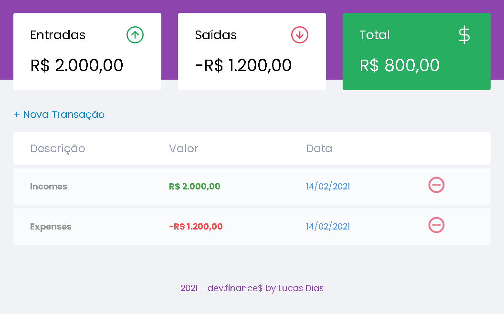

<h1 align="center">
    
</h1>

# Sumário

- [Description](#📝-Description)
- [Project](#💻-Project)
- [Technologies](#🚀-Technologies)
- [Project Stats](#🎯-Project-Stats)

---

## 📝 Description

>💻 Dev.finances is a budget application, where you can register and delete transactions and see the balance of incoming and expenses, the project was created Rocketseat in order to explore notions of HTML, CSS and JavaScript. 💰

---

## 💻 Project

* <b>Incoming and Expensess</b>: It is possible to monitor how much has been spent and how much has been received, with the total result of available money.

* <b>New Transaction</b>: It is possible to insert new values, either expenses or income.

* <b>Transactions Details</b>: The user has access to the transaction history on the page, and it is also possible to delete any transaction, being updated the amount at the entry, exit and total at the top of the screen.

<h1 align="center">
    
</h1>

---

## 🚀 Technologies
Esse projeto foi desenvolvido com as seguintes tecnologias:
* VS Code;
* HTML;
* CSS;
* JavaScript.

---

## 🎯 Project Stats

Este projeto atualmente está finalizado.

---

## :heavy_check_mark: To do list

- Dark Mode
- Botão de apagar todas as transações

---

## :handshake: Become a Contributor

Tem alguma ideia que poderia alavancar ainda mais o projeto, e deseja implementar? É simples!

1. Faça um fork do projeto
2. Modifique o que achar necessário
3. Faça o commit das mudanças
4. Crie um Pull Request

---

## Author

- Projects - [Lucass2021](https://github.com/Lucass2021)

- Linkedin - [@Lucas Dias da Silva](https://www.linkedin.com/in/lucas-dias-da-silva-118954199/)

- Email - [Lucas Dias](mailto:lucas.allx@hotmail.com")
